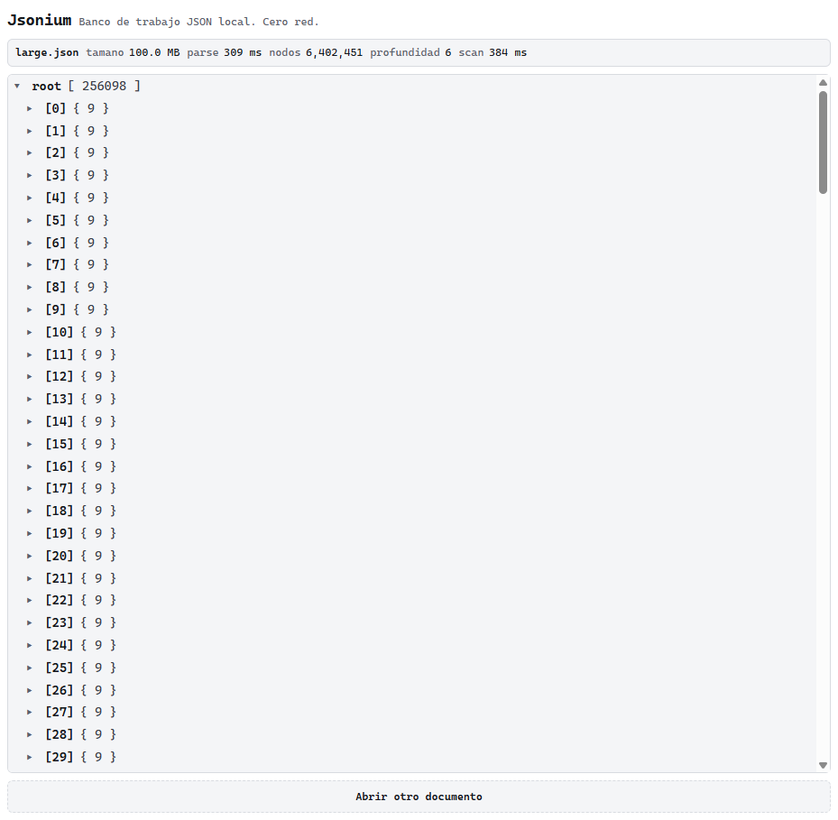

# Jsonium

**A local-first JSON workbench that opens 100 MB files in under a second — and never sends your data anywhere.**

> ⚠️ **Early development (v0.1.0).** The performance core is built and measured. The rest of the
> toolbelt — semantic diff, jq, JSON Schema, codegen, mocks — is on the roadmap below.



---

## Why

Every developer ends up on some "json formatter online" site. Those sites are full of ads, they
**upload your payload to a server**, and they die on anything large. Paste a production response
with customer data or a bearer token, and it has already left your machine.

Jsonium is the opposite: everything runs in your browser, in Web Workers, and the app makes
**zero network requests** after the initial load. You can verify that in DevTools with the network
tab open — or just turn on airplane mode.

## Benchmarks

Measured on a 100 MB synthetic JSON file (256,098 records, 6.4 M nodes, nesting depth 6).
Reproduce them yourself with `npm run bench` — the fixture generator is in `bench/`.

| Operation | Chrome (Web Worker) | Node 24 |
| --- | ---: | ---: |
| `JSON.parse` of 100 MB | **309 ms** | 789 ms |
| Full document scan (6.4 M nodes) | **384 ms** | 294 ms |
| First tree render | instant (virtualized) | — |
| Heap after parse | — | 285 MB |

Other numbers that matter:

| Metric | Value |
| --- | ---: |
| Production bundle (gzip) | **67 kB** |
| Network requests after load | **0** |
| DOM nodes for a 256,098-item array | ~35 |

## Privacy, concretely

- **Zero network.** No analytics, no remote fonts, no CDNs, no telemetry — not even "just for errors".
- **Enforced by the browser.** The production build ships a strict Content Security Policy with
  `default-src 'none'` and `connect-src 'none'`. The browser itself refuses to let the page open a
  connection, whatever the code tries to do.
- **Enforced by CI.** The build fails if network primitives (`fetch`, `XMLHttpRequest`, `WebSocket`,
  `sendBeacon`) appear anywhere in the bundle.
- **Enforced by lint.** Those same primitives are ESLint errors in the source.
- **One copy of your document.** The parsed document lives only inside the worker. The UI asks for
  small page-sized slices by node id and never receives the whole thing.

## What works today

- Drag & drop or pick a local JSON file (100 MB+ handled comfortably)
- Parsing in a Web Worker — the UI never freezes
- Virtualized tree with lazy expansion, paged 200 children at a time
- Document statistics: node count, max depth, type histogram
- Iterative traversal throughout, so deeply nested documents cannot blow the stack
  (tested to 200,000 levels)

## Roadmap

| Phase | Scope |
| --- | --- |
| 1 | CodeMirror 6 editor, format / minify / sort keys, near-valid JSON repair, path search |
| 2 | Semantic diff between two documents, JSON ↔ YAML / CSV / TOML conversion |
| 3 | Offline PWA, keyboard shortcuts, reproducible benchmarks, v0.1.0 release |
| 4 | jq (WASM) and JSONPath playground, JSON Schema validation and inference |
| 5 | Type generation (TypeScript, Go, Rust, Python…), mock generation, URL sharing via `#fragment` |

## Getting started

```bash
npm install
npm run dev        # http://localhost:5173
```

Other scripts:

```bash
npm run typecheck  # tsc --noEmit
npm run lint       # ESLint, zero warnings allowed
npm test           # Vitest
npm run build      # production build with CSP injection
npm run preview    # serve the production build

node bench/generate.mjs 100   # generate a 100 MB fixture
npm run bench                 # measure parse + scan against it
```

Requires Node 24+.

## Architecture

```
UI (main thread)  ──postMessage──▶  parse worker
  tool tabs                          owns the single parsed copy
  virtualized tree                   answers with small node summaries
  node ids, never values             { id, key, kind, preview, childCount }
```

The document is parsed once inside the worker and never serialized back. The UI holds only the
summaries of the nodes currently on screen, which is what makes a 100 MB file feel the same as a
1 kB one.

Stack: Vite · React 19 · TypeScript (strict) · Web Workers · [virtua](https://github.com/inokawa/virtua)

## License

MIT

---
---

# Jsonium (español)

**Un banco de trabajo JSON local que abre archivos de 100 MB en menos de un segundo y nunca envía tus datos a ningún sitio.**

> ⚠️ **Desarrollo temprano (v0.1.0).** El núcleo de rendimiento está construido y medido. El resto de
> herramientas — diff semántico, jq, JSON Schema, generación de tipos y mocks — está en el roadmap.

## Por qué

Todo desarrollador acaba en alguna web de "json formatter online". Están llenas de anuncios,
**suben tu payload a un servidor** y se mueren con archivos grandes. Si pegas una respuesta de
producción con datos de clientes o un token, ya ha salido de tu máquina.

Jsonium es lo contrario: todo ocurre en tu navegador, dentro de Web Workers, y la aplicación hace
**cero peticiones de red** después de la carga inicial. Puedes comprobarlo en DevTools con la
pestaña de red abierta, o directamente en modo avión.

## Benchmarks

Medido sobre un JSON sintético de 100 MB (256.098 registros, 6,4 M de nodos, profundidad 6).
Reprodúcelo con `npm run bench`.

| Operación | Chrome (Web Worker) | Node 24 |
| --- | ---: | ---: |
| `JSON.parse` de 100 MB | **309 ms** | 789 ms |
| Recorrido completo (6,4 M nodos) | **384 ms** | 294 ms |
| Primer render del árbol | instantáneo (virtualizado) | — |
| Heap tras el parse | — | 285 MB |

| Métrica | Valor |
| --- | ---: |
| Bundle de producción (gzip) | **67 kB** |
| Peticiones de red tras la carga | **0** |
| Nodos del DOM para un array de 256.098 elementos | ~35 |

## Privacidad, en concreto

- **Cero red.** Sin analítica, sin fuentes remotas, sin CDNs, sin telemetría.
- **Lo impone el navegador.** El build de producción incluye una CSP estricta con
  `default-src 'none'` y `connect-src 'none'`.
- **Lo impone la CI.** El build falla si aparecen primitivas de red en el bundle.
- **Lo impone el linter.** Esas primitivas son errores de ESLint en el código fuente.
- **Una sola copia del documento.** El documento parseado vive únicamente en el worker.

## Qué funciona hoy

- Arrastrar y soltar (o elegir) un archivo JSON local; 100 MB se manejan con soltura
- Parseo en Web Worker: la interfaz nunca se congela
- Árbol virtualizado con expansión perezosa, paginado de 200 hijos
- Estadísticas del documento: número de nodos, profundidad máxima, histograma de tipos
- Recorridos iterativos en todo el núcleo: el anidamiento profundo no desborda la pila
  (probado con 200.000 niveles)

## Empezar

```bash
npm install
npm run dev        # http://localhost:5173
```

Requiere Node 24+.

## Licencia

MIT
